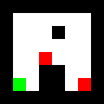

img2level
=========

img2level is a simple command line php script for converting an image into a json game level, letting you use your favorite image editor as a level editor.

## Available options

> -f &lt;file>, --file=&lt;file>  
>     Specifies the source file to convert. Ignored if -d or --dir is used.
> 
> -d &lt;directory>, --dir=&lt;directory>  
>     Converts all the files in the specified directory into an array of levels
> 
> -h, --help  
>     Displays this message
> 
> -t &lt;file,directory>, --target=&lt;file,directory> //TODO  
>     Write the result in the target file or directory.  
>     If the target is a directory, a file will be created for each source image.

> -c &lt;file>, --config=&lt;file>  
>     Specifies the config file to use

## Exemple usage

> *php img2level.php -f img.png*  
Will parse the *img.png* file and display the json result.

> *php img2level.php -d images -c mygame.config.php > mygame.json*  
This command will parse every image file in the *images* folder and write the result in the *mygame.json* file.
The configuration from *mygame.config.php* will be used

## Configuration file

img2level comes with an exemple configuration file named config.php  
The config file initializes and populates a php associative array named $config.  
The $config array must contain a *'colors'* element, itself an array describing how img2level must behave when encountering a color.  
Each key of the $config['colors'] array is the value of the color. For full color images (such as png-24), it must be a six characters RGB hexadecimal value. For indexed color images (such ad gif), it must be the index value of the color.  
Each element must be an associative array with at least a *'value'* element. This is the value which will be put in the *'data'* array of the json.  
It can optionnaly contain a *'object'* element, which is an array which will be copied in the *'objects'* value of the result, along with the coordinates of the objects.

### Example config file

    &lt;?php  
    $config = array(  
      'colors' => array(  
        'ffffff' => array('value' => 0),  
        '000000' => array('value' => 1),  
        '00ff00' => array('value' => 2),  
        'ff0000' => array('value' => 0, 'object' => array('type' => 'monster')),  
      ),  
    );

With this file, 4 colors will be used:  
- white *ffffff* for empty space
- black *000000* for walls
- green *00ff00* for the player starting position
- red *ff0000* for monsters

The resulting json will be an associative array containing two elements:  
- the *'data'* element will be a two dimensionnal array of equal width and height as the image, containing for each cell the value defined in the *'colors'* array
- the *'objects'* element will contain, for each red pixel in the image, an array containing three values: *'monster'* in *'type'*, and the coordinates of the pixel in *'x'* and *'y'*

This file, used with the following image:  

will produce the following result (indentation, line breaks added for lisibility):  
    {  
      "data":[  
        [1,1,1,1,1,1,1,1],  
        [1,0,0,0,0,0,0,1],  
        [1,0,0,0,1,0,0,1],  
        [1,0,0,0,0,0,0,1],  
        [1,0,0,2,0,0,0,1],  
        [1,0,0,1,1,0,0,1],  
        [1,0,0,1,1,0,2,1],  
        [1,1,1,1,1,1,1,1]  
      ],  
      "objects":[  
        {"type":"monster","x":3,"y":4},  
        {"type":"monster","x":6,"y":6}  
      ]  
    }  

